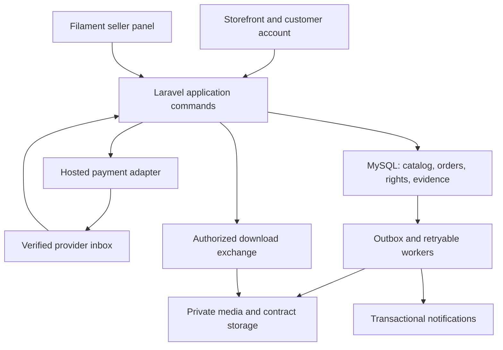

# VASEY.AUDIO replacement blueprint

Status: **Recommendation / target architecture**, 2026-09-04. This document defines the intended system. Consult the root README and test evidence for what is implemented.

Build one first-party application with a persistent seller control panel and a branded music storefront. The first complete transaction must preserve the relationship between the exact music files, the reviewed license, the buyer's assent, the payment, the executed document and every subsequent download.

## System boundary

A Laravel modular monolith owns catalog, rights, pricing, orders and entitlements in MySQL. An Inertia/React storefront and Filament administration call the same application commands. Private object storage holds masters, stems, contracts and buyer uploads. Isolated media workers and document workers execute bounded jobs. Redis coordinates queues/cache; it is not the authority for rights, payments, inventory or grants.

Payment, transactional email, tax, subscription and optional fulfillment providers sit behind adapters. Hosted checkout keeps payment-card entry outside the application. This does not by itself establish compliance, correct tax configuration or production readiness.

## Module ownership

| Module | Owns | Public application boundary |
| --- | --- | --- |
| Catalog | Track/product metadata, releases, collections/albums, tags, contributor display, discovery and sale readiness | DraftProduct, AssessReadiness, PublishProduct, SearchCatalog |
| Media | Upload sessions, quarantine, immutable source revisions, derivatives, waveform peaks and technical metadata | BeginUpload, VerifyUpload, ProcessMedia, PromoteAsset |
| Rights | Rights/sample declarations, license templates/versions, approvals and shared exclusive scope | SubmitLicenseReview, PublishLicenseVersion, ResolveDeliverables |
| Commerce | Carts, quotes, offers, promotions, orders, payments, refunds, disputes and exclusive reservations | QuoteCart, BeginCheckout, ReserveExclusive, FinalizePayment |
| Delivery | Durable grants, render inputs/contracts, entitlements, customer library and authorized URL issuance | RenderContract, ActivateFulfillment, ExchangeEntitlement |
| Identity/CRM | Accounts, roles, customer profile, consent, wishlist and support context | AuthorizeAction, RecordConsent, ClaimLegacyPurchase |
| SiteBuilder | Navigation, reusable content, homepage sections, sharing metadata, blog/video pages and atomic site releases | PreviewSiteRelease, PublishSiteRelease, RevertSiteRelease |
| Memberships | Plan versions, subscriptions, credit movements, eligibility and grandfathered benefits | ApplyBillingEvent, RedeemAllowance, ScheduleCancellation |
| Services | Inquiry, brief, quote, booking handoff, deposit milestones, revisions and delivery | SubmitInquiry, AcceptServiceQuote, CompleteMilestone |
| Merch | Variants, shipping/tax classification, stock/provider references and fulfillment/returns | QuoteShipment, SubmitFulfillment, ReconcileShipment |
| Migration/Ops | Import runs, source provenance, mappings, historical obligations, redirects and reconciliation | ValidateImport, CommitImportBatch, ReconcileSource, PrepareCutover |
| Shared support | Money, audit, idempotency, canonical hashes, inbox/outbox and correlation | Minimal primitives; no domain business rules |

Initial scaffold models/resources may live in conventional Laravel locations. Move behavior into module commands as it becomes substantive; do not perform a speculative directory-only rewrite or duplicate business policies inside Filament actions and React components.

## Storefront and customer scope

- Responsive home, searchable/filterable/sortable track catalog, track detail, license comparison, shared persistent player and waveform seeking.
- Audio previews are bounded derivatives; full masters are never decoded by the browser player. Queues, mobile media controls and autoplay restrictions are handled explicitly.
- Cart, validated discounts/bundles, quote expiration, hosted checkout, payment-pending/failure/recovery views and order status.
- Account access/recovery, saved tracks, purchase history, exact contract downloads and permitted re-downloads.
- Collections/albums, sound kits, free-download flows with a distinct license, services, memberships, merchandise, editorial/video and contact/support pages.
- Shareable canonical URLs, Open Graph assets, sitemap/redirect continuity, accessibility and reduced motion. Public sharing and marketing consent are separate operations.

Every surface must show its real state. Empty catalog, unavailable preview, pending payment, failed document and restricted delivery need usable customer and operator recovery. A card or navigation link is not evidence that a feature works.

## Seller panel

The seller workflow is: upload → inspect processing/rights → edit metadata → assign reviewed license/price/deliverables → preview → publish → share → manage orders/support. Support bulk metadata operations only with previews, explicit affected IDs and audit records.

The panel needs:

1. Product/track/kit/album management, metadata, artwork, categorization and stable slugs.
2. Resumable private file ingestion, processing progress, revision history and failed-job recovery.
3. License authoring/review/version diff, SKU assignment and publication blockers.
4. Orders, grants, contracts, fulfillment exceptions, refunds/disputes and exportable reconciliation.
5. Site content/navigation/hero/SEO/social artwork and release preview/rollback.
6. Promotions, membership plan administration, customer consent and permitted communication exports.
7. Services, merchandise, imports, redirects, audit history, roles/MFA and operational health.

Seller edits cannot change a historic purchase. “Replace WAV” creates a new revision; new offers resolve it explicitly. Prior customers retain their purchased revision unless an approved policy grants an additional replacement entitlement with an audit trail.

## Complete replacement versus first milestone

The first milestone is a verified track-sale path. All features remain in the parity ledger even if scheduled later. Active membership billing, promised credits, pending services, unfulfilled merchandise, historic contracts and download obligations are not optional merely because the new feature flag is off. They need supported migration or an explicit continuity arrangement before their source service can retire.

Integrations such as distribution/publishing administration may replace a workflow through a verified handoff; they need not be rebuilt as businesses inside this app. Account-specific evidence determines the requirement. Do not import platform marketing claims as facts about Sean's current account.

## Constraints and failure containment

- Fail closed for sale readiness, rights, payment confirmation and entitlement ownership.
- Persist provider notifications before acknowledging work; process effects with both business and provider-object idempotency.
- A real paid payment that cannot safely fulfill becomes an operator-visible paid exception. Never label it unpaid to simplify code.
- Preserve valid prior non-exclusive grants after an exclusive sale.
- Keep a denied download, revoked entitlement, disputed payment and terminated license as separate concepts.
- No source masters, secrets, private contracts, customer records or payment bodies in GitHub fixtures.
- Do not change www.VASEY.AUDIO DNS or retire BeatStars until the scoped cutover packet is verified.
