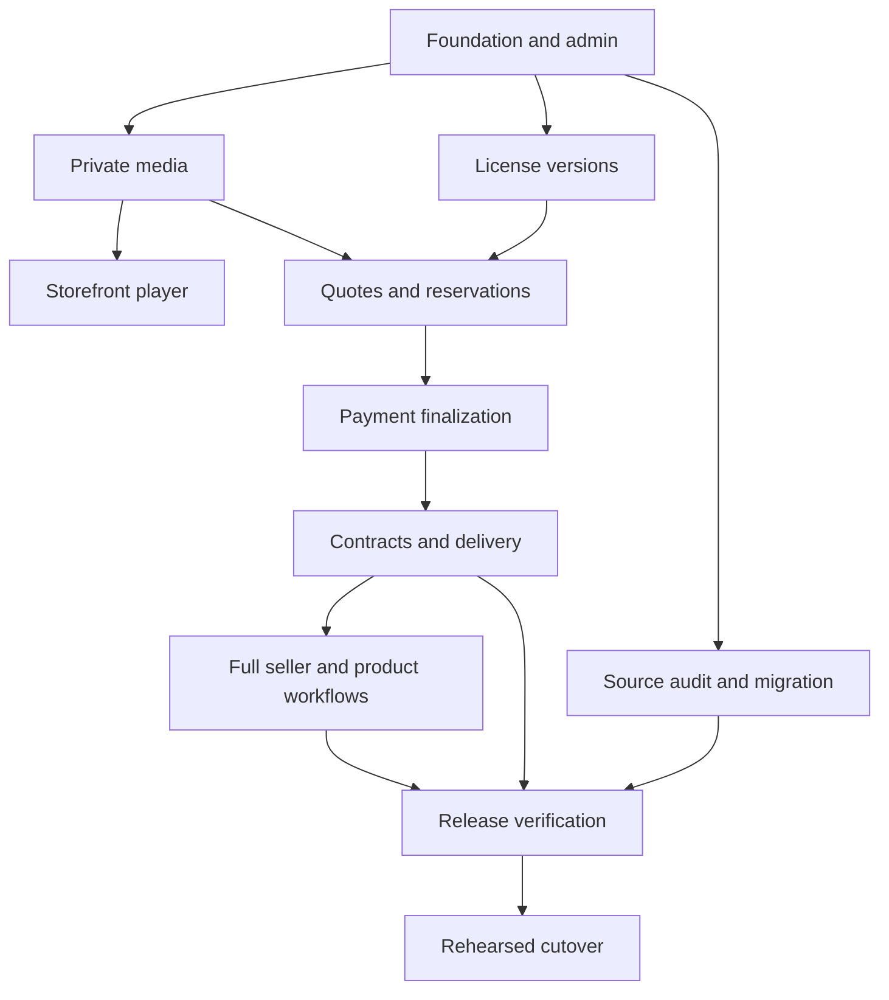

# Phased delivery roadmap

Status: **Recommended delivery sequence**, 2026-09-04. Dates and estimates are intentionally unset until source inventory and the first vertical slice provide evidence.

The goal is a complete replacement. Phases control implementation order, not a reduction of the requested feature set. A phase cannot strand an existing purchase, member, service obligation or contractual right.

| Phase | Work packages | Deliverable / exit evidence |
| --- | --- | --- |
| 0 — Foundation and source truth | WP-01, WP-02; begin WP-12 audit | Reproducible app, real authorized admin access, active-theme source mapping, published-only catalog and explicit source obligations. |
| 1 — Media and rights | WP-03, WP-04, WP-05 | Quarantined private upload through preview/player and reviewed immutable license/offer readiness. |
| 2 — One paid track end to end | WP-06, WP-07, WP-08 | Synthetic provider-confirmed purchase, exact contract/assets, authorized re-download, replay/concurrency/exception proof. Live enablement requires its actual provider/legal gates. |
| 3 — Seller workflow and full product coverage | WP-09, WP-10, WP-11 | CMS/sharing/promotions; albums/kits/services/merch; memberships/customer retention and support, with operational acceptance. |
| 4 — Migration and release | WP-12, WP-13, WP-14 | Source-to-target reconciliation, preserved obligations/SEO, restore and rollback rehearsal, exact candidate release evidence and domain cutover. |

WP-12 begins source inspection during Phase 0 and concludes migration later. If it finds active memberships, pending services, merchandise orders, collaborators or other obligations, pull the required portion of WP-10/WP-11 forward before source retirement. Feature flags cannot waive those obligations.

## Dependency graph

## Agent execution contract

Use one bounded work package per branch/PR where practical. Read repository instructions, this index, the package and affected source evidence first. Inspect the current code before regenerating anything. Declare files and interfaces touched; coordinate shared migrations/types with parallel agents. Build on prior accepted contracts.

Every PR explains the user-visible problem, changed behavior, database/provider consequences, tests actually run, exact unresolved blockers and rollback. Include only synthetic fixtures. A reviewer independently checks financial/rights/security changes; no agent approves its own unverified claims.

If a package is too large for one reviewable change, implement its named first increment and split the remainder into dependent issues without claiming the package complete. The 14 packages are tracked delivery units, not a mandate for 14 oversized commits. Use current official documentation for changing third-party behavior.

## Review gates

- Foundation gate: install from lockfiles, migrated database, authenticated authorized admin and published-only catalog.
- Media/rights gate: private immutable files, verified derivatives, valid rights declaration, consistent reviewed terms and named readiness blockers.
- Commerce gate: quotes frozen, hosted-provider confirmation, shared exclusive lock, durable idempotent effects and paid-exception recovery.
- Fulfillment gate: exact buyer contract, exact asset revision, ownership/cap enforcement, retry recovery and historical preservation.
- Replacement gate: parity ledger has no unexplained omissions; active obligations are migrated or have an approved continuity path.
- Release gate: staging evidence at the exact candidate, accessibility/security/ops results, restore and rollback rehearsal and resolved production decisions.

## Work that can proceed now

Complete the scaffold/admin/catalog verification, add private media processing and the licensed-offer model, and build the public player against those contracts. Draft source migration tooling and fixtures in parallel. External account setup, active contracts and DNS changes are not prerequisites for these reversible steps.

The first live transaction is enabled only after the complete track-sale chain and its applicable decisions are verified. The current request does not justify representing this foundation as a finished replacement.
